# October 2017: The urgent desire to build my own M.A.M.E Arcade Cabinet

Born in 1976 I still remember the great arcades from my first visit to London at the age of 17. We also had arcade machines in our small town, in almost every restaurant there was a PacMan, Double Dragon or some other machine showing off amazing graphics. I remember discussing with a friend how home computers or consoles would never ever be able to reach such awesome performance. **We were young. And wrong.**

Meanwhile, arcade machines have become a thing of the past and when I was in the process of building my own, my son’s friends (aged 9) asked me what I was doing there. When I answered that this was an arcade machine, they just said _“Ok.”_ and moved on, probably thinking it was some sort of IKEA storage cabinet for my kitchen. **They simply did not know what an arcade machine was!**

When I was 21, I had an original arcade machine in my apartment. It was some Double Dragon like game. I bought the full size arcade for DM700 back then (about €360) and sold it two years later for about €150. At the same time, a friend bought a table video game with a version of Space Invaders and he still has it.

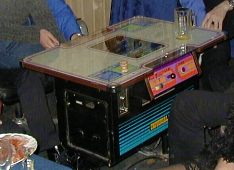

Table top arcade

Every time I visit him I would get angry at myself for selling my own arcade. **Well, no more!**

## Getting the parts

I have used [MAME](http://mamedev.org/) over the years on Windows and on Mac. But running the emulations on a regular PC is not the same thing as playing the games on the real hardware and finally, in October 2017 I made a decision while browsing the web: I will build my own cabinet. Why? Maybe because my son was sitting next to me and he liked the idea (for obvious reasons). Maybe because I’m 41 and it is my version of a midlife crisis. I don’t know and actually: no reason is required! It’s something I would enjoy building, so why not?

So my son and I started our shopping tour at Amazon:

*   Black Logitech optical mouse (€8, https://www.amazon.de/gp/product/B00AZKNPZC/ref=oh\_aui\_detailpage\_o01\_s00?ie=UTF8&psc=1)
*   Black Cherry keyboard (€10, https://www.amazon.de/gp/product/B00F35N0VI/ref=oh\_aui\_detailpage\_o02\_s00?ie=UTF8&psc=1)
*   LED Stripe for top marquee (€18, https://www.amazon.de/gp/product/B01K4XM2ZI/ref=oh\_aui\_detailpage\_o03\_s00?ie=UTF8&psc=1)
*   JVC Speakers 10cm 180W (€18, https://www.amazon.de/gp/product/B00BQAN6RM/ref=oh\_aui\_detailpage\_o04\_s00?ie=UTF8&psc=1)
*   LEPY Amplifier (€20, https://www.amazon.de/gp/product/B00OPKJMI2/ref=oh\_aui\_detailpage\_o04\_s00?ie=UTF8&psc=1)
*   Raspberry Pi 3 Set (€70, https://www.amazon.de/gp/product/B01N2L1GN1/ref=oh\_aui\_detailpage\_o05\_s00?ie=UTF8&psc=1)
*   Arcade jJoysticks and buttons set (€40, https://www.amazon.de/gp/product/B074MP4FRD/ref=oh\_aui\_detailpage\_o06\_s00?ie=UTF8&psc=1)

**Money spent: €178**

The plan was to build the cabinet based on a Raspberry Pi. I thought about using an old PC or Mac but the small Pi seemed to be the better option: less heat, enough power, cheap.

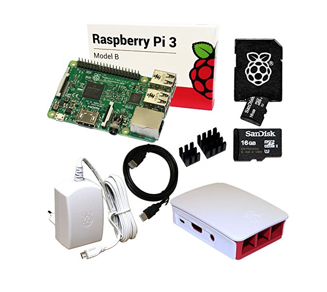

Raspberry Pi 3 Set with WiFi and 16GB SD and case

The Pi has 4 USB ports, audio out, Ethernet and HDMI out. 4 ports are optimal because I had to connect mouse, keyboard and two joysticks. But wait a second: HDMI? A real retro arcade machine should have a CRT and those do not have HDMI ports. However, I eventually decided against a CRT for various reasons:

* Heavy
* Surprisingly hard to find a good one that still works
* Increases the depth of the arcade
* Quality of menu/text output would suck

That’s why I went for a 24″ LCD TV I still had in the basement. It is an AOC and has HDMI in, SCART in, SVIDEO in, Audio in and supports a resolution of 720p. The SCART input would come handy, because I also knew I wanted to connect my old SNES (Super Famicom) and Playstation 2, as well as a C64 DTV joystick.

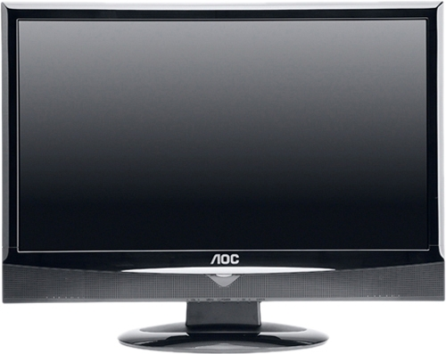

AOC LCD TV

Bonus: the TV would come for free! A 24″ monitor would have added around €100 to the total costs. Money better invested into pizza while building the cabinet! 🙂

## It was time to setup the software

Raspberry Pi and MAME are a match made in heaven; really all that is needed is an installation image of [RetroPie](https://retropie.org.uk/)  and when booting up everything is there! Just add ROMs, disk images, tape images or whatever the platform you are trying to emulate supports. RetroPie offers a beautiful frontend UI, hides all the config file editing and is a joy to use. Of course, using the keyboard and mouse on a Pi is not that different from using these input devices on a desktop PC, so the first thing I did was to connect my old Xbox 360 wireless controller. That felt a lot better and worked seamlessly: RetroPie detects the controller and let’s you configure all buttons and axis.

Let me share all the links with you that I found and still find useful:

* RetroPie: https://retropie.org.uk
* RetroPie Github repo with wiki (this really answers anything you possible want to know about emulation on a Raspberry): https://github.com/retropie/retropie-setup/wiki/Arcade
* Make your LCD output look crappy: https://github.com/RetroPie/RetroPie-Setup/wiki/Shaders-and-Smoothing
* MAME compatible ROMs: https://archive.org/details/MAME2003\_Reference\_Set\_MAME0.78\_ROMs\_CHDs\_Samples

## Make it feel a bit more like an actual arcade

This LCD…something felt wrong about it. It was too sharp, the picture too crisp. The games did not look the way I remembered them. The problem is that modern LCDs don’t work like CRTs and don’t show [scanlines](https://en.wikipedia.org/wiki/Scan_line) .

No scanlines left, with scanlines right

These scanlines are an essential part of the retro experience and my original intention to go with a CRT but luckily there are very good shaders out there which simulate scanlines and – if wanted – even a cushion effect. You can read more about it on [RetroPie’s wiki](https://github.com/RetroPie/RetroPie-Setup/wiki/Shaders-and-Smoothing) .

The other thing is of course the input device. Although the Xbox controller was clear improvement, only real arcade controls would make it into my cabinet. Here’s what I bought on Amazon:

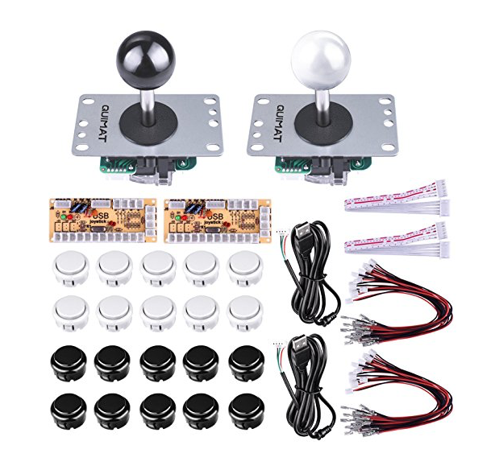

Joysticks and buttons

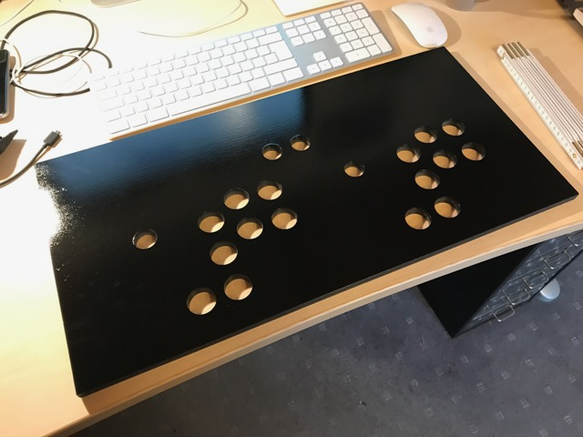

Input panel

The set above comes with two sticks and 20 buttons, as well as two USB controller interfaces. Just connect everything and it will be detected as two separate input devices. I decided to use a 12mm wood panel (MDF), covered by 2mm acrylic glass which I bought on the internet at [Plattenshop24](https://www.plattenshop24.com/)   and drilled holes into it.

Of course this would need some styling. I decided to use PacMan stickers which I bought on eBay for €5. The result is really good:

![Panel]panel2.jpg)

Completed panel

**Money spent: €16 for acrylic glass (2mm for input panel, 5mm for top marquee) + €5 for stickers = €21**

## Building the cabinet

You might wonder how I knew where to drill the holes into my input panel. The secret is: I had a plan! 🙂 When I did some research I found that a lot of arcade cabinets looked the same and the reason might be that many of them are built using the same plans. I found one at  [koenigs.dk](http://koenigs.dk/mame/eng/index.htm)  – they have different MAME cabinet versions you can get plans for. My choice was the [“2 Player Upright” version](http://koenigs.dk/mame/eng/stepprojectmame.htm) .

Here’s what I bought:

* MDF 12mm wood for the input panel (60cm wide)
* MDF 16mm for the rest of the cabinet (all 60cm wide)
* side parts: CNC cut, 16mm MDF
* drawer rails keyboard drawer
* Hinges
* Handle

**Money spent: about €50 for all the 60cm parts. My local [OBI](https://www.obi.de/baumarkt/stephanskirchen/?wt_mc=seab.google.brand_kombi_standorte.marktseite.stephanskirchen&wt_cc1=770390760&wt_cc2=obi%20stephanskirchen)  market had all of the wood available and the prize includes cutting the individual pieces according to the plans. In addition, €60 and some beer for the two side panels. A friend cut them from one piece.**   **And then €15 for the drawer rails plus some Euro for the hinges.**

Now it was just a matter of putting it all together and I started by priming the main parts.

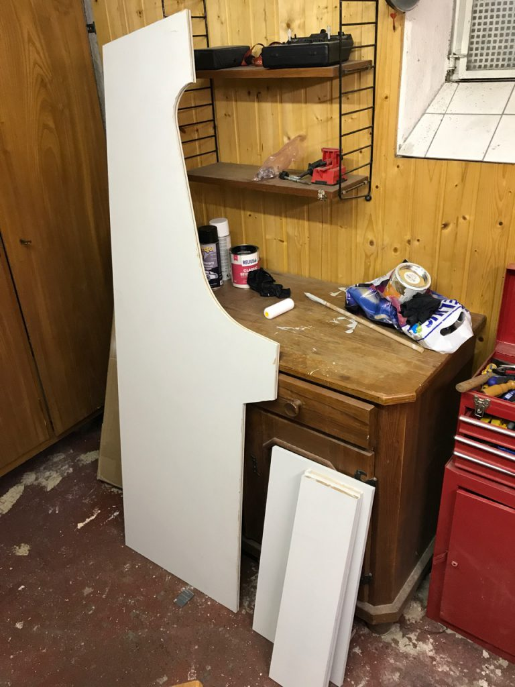

Priming

Some wood borders and screws later the main cabinet was done. There was one additional step: all of the old arcade machines had T-molding (a plastic bumber strip to protect the edges of the wood) and I wanted this too. So I borrowed a holding cutter from my neighbour (he’s a carpenter) after 15 minutes of extreme noise and dust, the job was done.

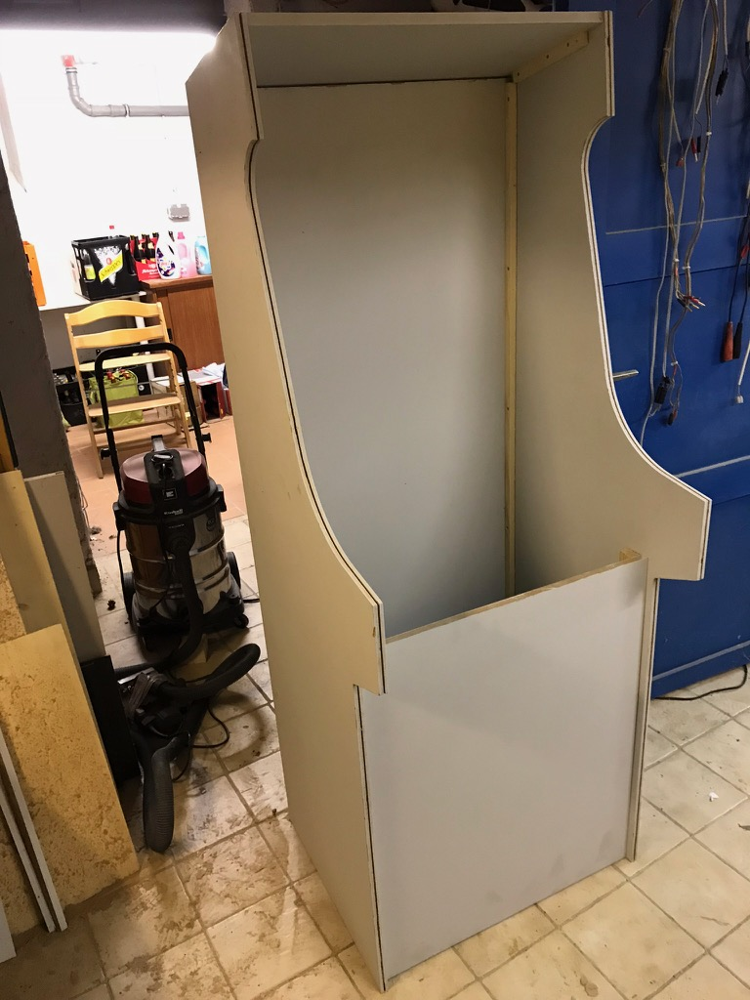

Main parts assembled

Since my cabinet should have a keyboard, mouse and possibly a few other input devices I wanted them to be easily accessible and that’s why I decided to build my first drawer. Not pretty, but it won’t be visible too often. Getting all the holes into the right locations was challenging.  
The main body of the cabinet was empty and felt like wasted space. I mentioned earlier that there’s still an SNES and a PS2 floating around in the house and I wanted to give these old consoles a new home. That made me add a little door into the lower part of the cabinet.  
The cabinet’s height is about 160cm. I decided to add 6cm of additional height by putting some wooden feet under it. Now it is exactly the right height for me (185cm). One of the most challenging parts was to install the LCD into the cabinet. I removed the foot of the TV and installed it into a custom frame made from wood borders. The TV is held in place via its VESA mount. To create an exact frame around it I bought some balsa wood (20mm) then carved and sanded it until it would perfectly fit around the monitor. Some black silicone is further fixing everything.

## Painting and final touches

After an hour of sanding, painting started with black spraying cans. When the first can was empty, I did some quick calculation and figured that I would need €200 for the black color in cans. So I changed plans and bought some paint that could be applied with a foam roll. That was a lot cheaper. The only problem with that particular paint was that it refused to dry. I was later told that it needs light to dry. And a warm environment. And dry air – but not too dry. And it has to handled carefully. I felt like I had bought some sensitive plant! Because I had not painted the side parts yet, I decided to switch plans and make them light blue instead of black because I knew that this different color brand would dry faster (and it was cheaper too!). But wait a second: light blue!? Why on earth? Please be patient.

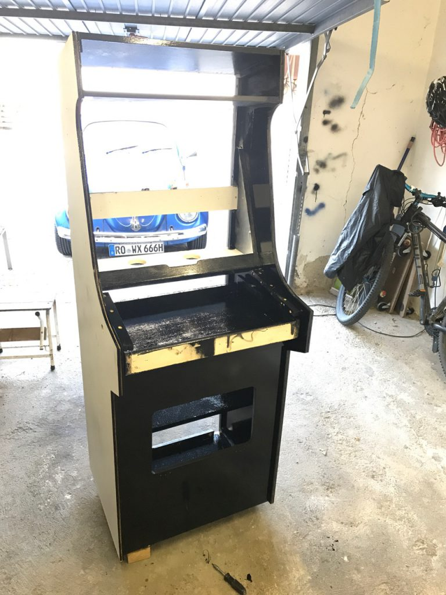

Monitor mounting and painting

**Money spent: €10 for sanding paper, €100 for paint**

With the painting done, I took the cabinet into our living room for final touches. _(Note: yes, my wife was totally fine with this, she even helped me carrying the cabinet. You’re the best. I love you!)_ The monitor needed final adjustments, the drawer needed a front cover and the speaker panel had to be mounted.

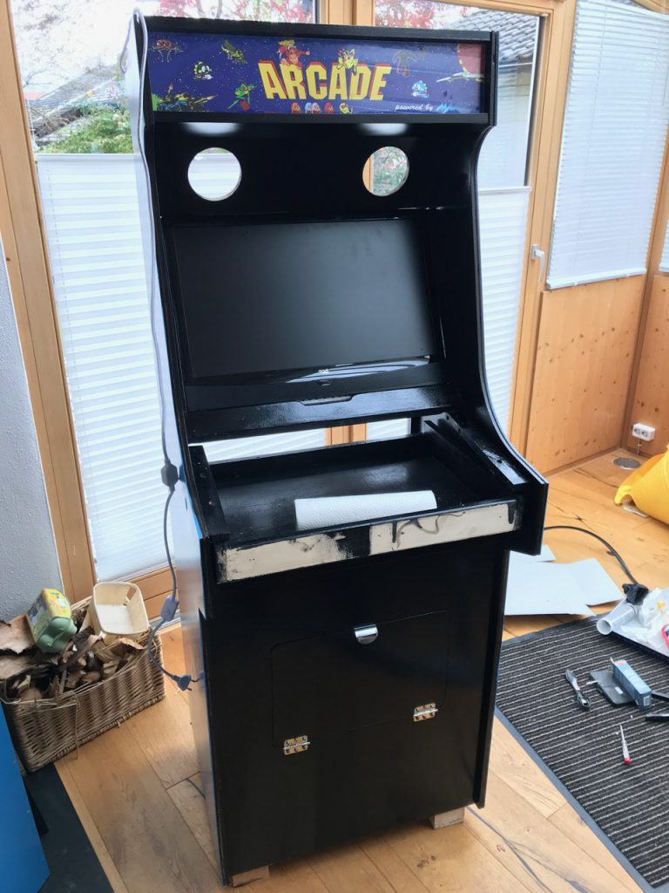

Preparing speakers

The speakers are 10cm in diameter and are specified with 180W. More than enough for this cabinet.

The panel fit nicely into place, as well as the top marquee which is a design I found on the internet and I had it printed on backlit film by [MyPoster](https://www.myposter.de/) . To light it up the LED strip from Amazon is built into the space behind it.

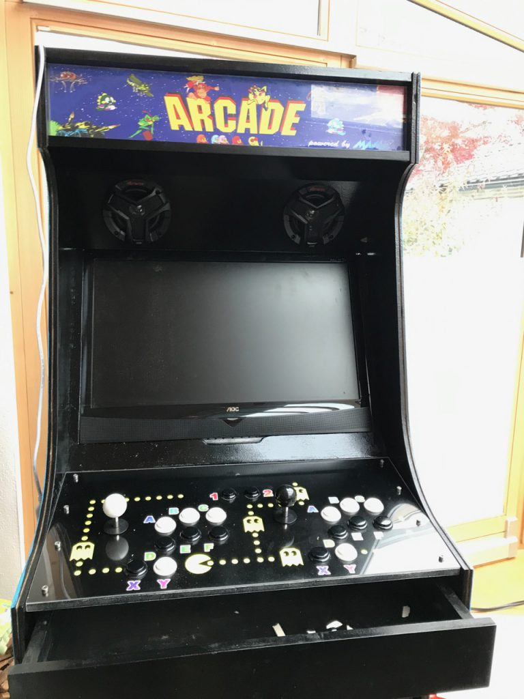

Panel in place and marquee

Now back to the side panels: the reason for the light blue side panels was that I had a special design in mind. I wanted to have a Super Mario based theming and the background in the Mario Jump and Runs is…? Exactly, light blue while the underworld levels have black background. On eBay I found some really cool retro-8bit-pixelated [wall stickers](https://www.ebay.de/itm/282074985477).

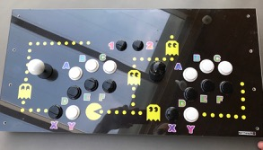

Mario 8bit

There are many offers for the modern variations of Mario but it was hard to find this retro art and with the help of my son, we created a nice design:

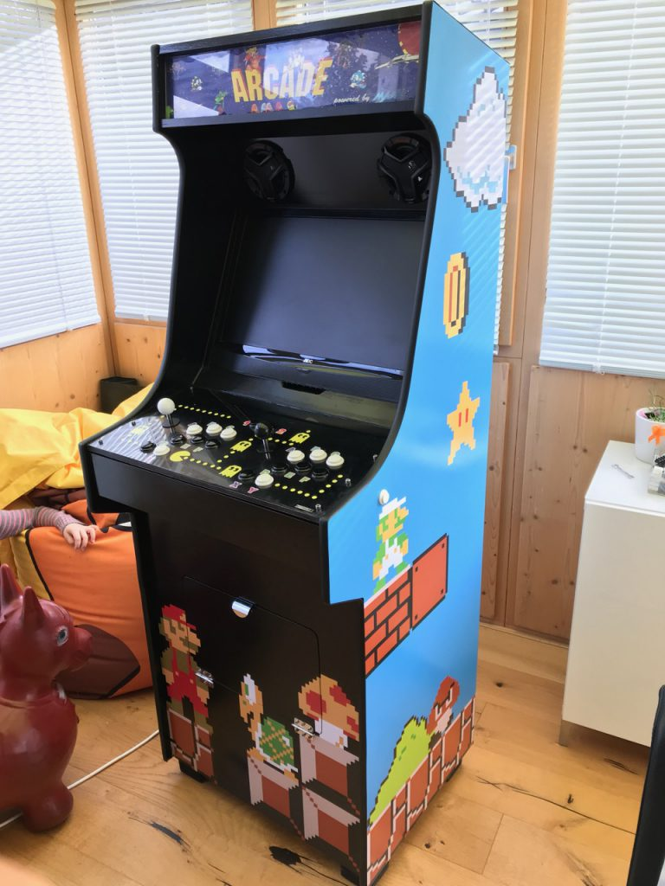

Right side

The right side is showing Luigi, on the front we created an underworld level with Super Mario.  
On the left, we went for regular Mario and an evil biting plant. The other thing visible from the image above is the T-mold which I bought from [Schreinerei Linden on eBay](https://www.ebay.de/usr/schreinereilinden).

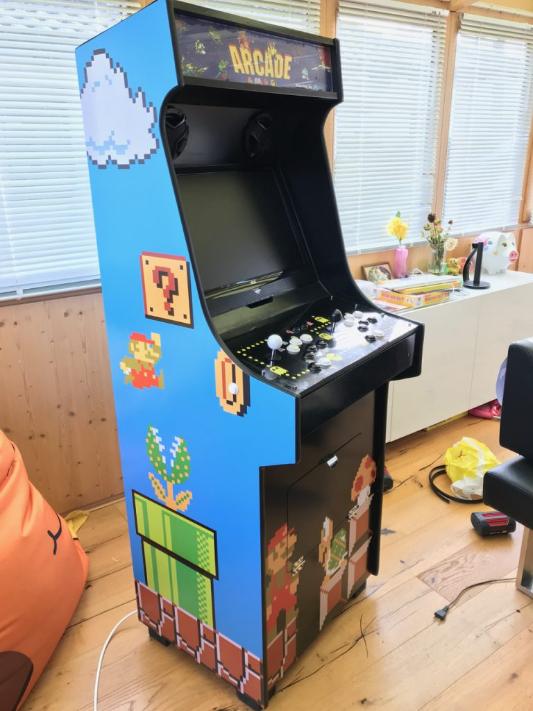

Left side

**Money spent: €26 for wall stickers, €24 for top marquee printing, €29 for T-mold**

And that’s it. Now I can enjoy all of my favourite arcade games and on top of that I can play my own games which I wrote back in 1993! For details, see [here](/content/blog/my-personal-digital-treasure-chest-how-dosbox-keeps-memories-alive)

**Let’s wrap up the total investment:**

* Material: about €500
* Time: hard to say…including all planning maybe 60h

Was it worth it? Absolutely! Could I have bought a prebuilt one? Maybe but not an option for me. Can you build your own? Yes, if you have access to the required tools.