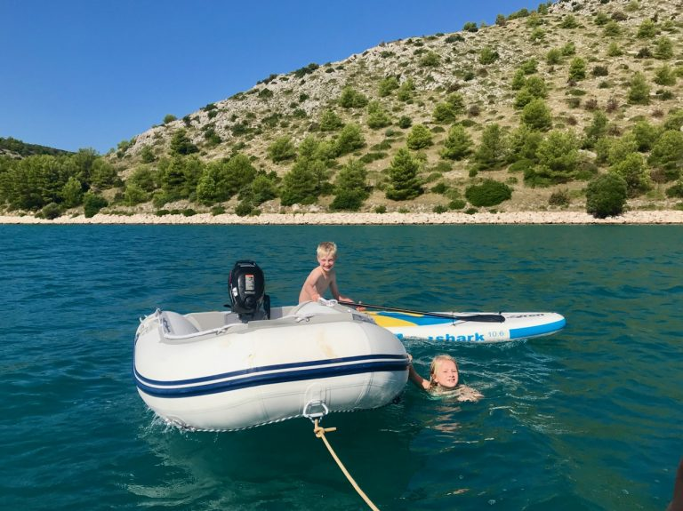

# September 2018: Segeln mit der Familie in Sukošan (Kroatien)

Dieser Post soll all denen helfen, die sich überlegen, ob es eine gute Idee ist, mit Partner und Kindern auf einen (kurzen) Segeltörn zu gehen. Die kurze Antwort: tut es! Aber jetzt im Detail.

Nach zwei SKS Prüfungstörns (Slowenien und Gran Canaria) – dabei beim ersten durchgefallen – und einem Skippertraining in Kroatien, sowie zwei Ausflügen auf kleineren Yachten, sollte es nun der erste Törn als eigenverantwortlicher Skipper werden. Eine Elan Impression 444 wurde auserkoren als Schiff: Einzelruder, schlank, Rollgroß und einen Gashebel, welcher sinnvoll positioniert ist; etwas, das sonst kein anderer Yachthersteller zu beherrschen scheint. Die Besatzung: meine Frau (keine Segelerfahrung, aber eine coole Sau, die schnell lernt), meine zwei Kinder (er 10 und sie 7) und meine Tante und mein Onkel (sehr oft als Mitsegler unterwegs). Wir hatten uns die Kornaten als Ziel ausgesucht, da einsteigerfreundlich und angeblich wunderschön.

Organisiert hat unseren Törn die Firma [Yachten Meltl](https://yachten-meltl.de) – mein besonderer Dank hier nochmal an Frau Lisa Kelebek, welche mit einer Engelsgeduld ein passendes Boot für uns herausgesucht hat: die Escape.

Elan Impression 444 – Escape

## Tag 1: Anreise Sukošan

Nach langer Autofahrt mit Kindern, die sich mit Netflix & iPad selbst unterhalten haben, final Ankunft in der Marina Dalmacija in Sukošan und dem Büro von Reful Yachting, wo uns eine sehr freundliche Dame bei der Erledigung des Papierkrams half. Übernahme Boot gegen 17 Uhr. Dies entsprach der vereinbarten Zeit, aber man sagte uns, dass das Boot normalerweise um 14 Uhr fertig sei. Nur leider machte ein Gewittersturm einen Strich durch die Rechnung, so dass erst später mit der Reinigung begonnen werden konnte. Um 23 Uhr holte ich den Rest der Mannschaft am Airport in Zadar ab, welcher nur circa 20 Minuten entfernt ist. Bei Ausfahrt mit dem Auto aus der Marina ist an einer Schranke die Parkgebühr zu entrichten, welche €11 pro Tag beträgt. Das Parkhäuschen ist 24h besetzt. Danach ging es ins Bett und ich war tierisch aufgeregt und hatte das Gefühl, alles vergessen zu haben, was ich während meiner bisherigen (Ausbildungs)-Törns gelernt hatte. Wir machen Einkäufe in Zadar und schauen/hören uns die Meeresorgel an.

## Tag 2: Von Sukošan nach Muline Ugljan

Um 9 Uhr gehe ich die Creweinweisung nach Checkliste (das [Charterlogbuch Segeln](http://www.charter-logbuch.de/charter-logbuch-segeln/) ist ungemein praktisch!) durch und um 10 Uhr haben wir dann abgelegt. Muring fällt, Lee Achterleine los, Luv Achterleine fieren und raus aus der Box. Gegenüber natürlich Boote mit sehr flachen Muringleinen. Links neben mir war zwar niemand, aber trotzdem muss ich rangieren. Mit Hilfe des Bugstrahlruders kriege ich die Kurve. Ich bleibe ruhig…glaube ich. Jedenfalls kommen wir letztlich raus und nach ein bisschen Gewöhnung an das Boot heißt es: Segel setzen! Klar an Unterliekstrecker, klar an Reffleine und rauf mit dem Fetzen. Geht prima. Dreiviertel der Segelfläche raus reichen für den Anfang. Dann die Genua und wir segeln. Danach die Erkenntnis: ich bin Skipper und habe die Verantwortung für Boot und Mannschaft. Es läuft. Wir kreuzen wie die Weltmeister bis um 13 Uhr der Motor gestartet und die Segel geborgen werden. Um 14:45 mein erstes Bojenanlegemanöver und wir sind fest. Ausgiebig Zeit zum Baden und SUP fahren. Zum Essen geht es mit dem Dinghy zur Konoba Dino Sime. Bei der Rückfahrt ist unser Boot leicht zu erkennen: es ist das einzige ohne Toplicht. Nächstes Mal schalten wir es ein.  
**18,3 Seemeilen, Wind 10kt.**

## Tag 3: Von Muline Ugljan nach Luka

Das Ablegen von der Boje dauert. Wegen einer Sturmwarnung verzurrte uns ein Taucher am Betonblock der Boje mit unserer 50m langen Leine. Diese war am nächsten Tag hoffnungslos verheddert. Mit viel Geduld und einigen Kreisen ging es dann. Es war übrigens eine sehr ruhige Nacht ohne irgendeinen Wind…Murphy‘s Law. Nur 5,5Nm entfernt ist der U-Boot Bunker von Bokašin, welchen wir natürlich per Dinghy erforscht haben. Man kann auch direkt im Bunker festmachen. Auf Grund von Wind und Uniwssenheit über die Wasserttiefe habe ich aber lieber den Anker gesetzt weiter draußen. Anschließend, nach einem Stück unter Motor, geht’s bei Wind aus Nord mit 4kt Fahrt und Schmetterlingssegeln nach Süden und wir erreichen gegen 16 Uhr den Ort Luka auf Dugi Otok. Dort gibt es Murings, aber das Wasser ist nur 2m bis 2,5m tief. Wir haben 2,10m Tiefgang und ich kann nicht weit genug in den Hafen fahren um rückwärts an die Muring zu kommen. Ein Segler, der bereits angelgt hat, winkt uns an den den Kai bei den alten dicken Stahlpollern ohne Murings und hilft uns längsseits zu gehen. Hier haben wir knapp 3m Wassertiefe. Strom und Wasser gibt es nur theoretisch. Neben der Restaurantruine (die jetzt als riesiger Mülleimer zu dienen scheint) gibt es Anschlüsse aber sie sind alle tot. Im kleinen Café erfahre ich, dass nur von 1. April bis 1. September Betrieb ist. Na gut, zahlen wir halt nichts. Wasser haben wir genug (die Impression hat einen 500 Liter Tank!) und die Batterien sind voll.  
**11,6 Seemeilen, Wind 6-10kt**

## Tag 4: Von Luka zum Salzsee in der Bucht “Mir” (Telašćica Nationalpark)

Mal wieder Glück mit dem Wind beim Ablegen um 10:30 Uhr: es weht seitlich von der Pier und drückt uns weg. Mit Motor geht es knapp 3h lang dahin dank Flaute, dann kreuzen wir bei 10kt Wind knapp 2h lang auf und machen in der Bucht von Mir fest an einer Boje. Dabei muss eine recht enge Passage durchquert werden mit 3,5m bis 5m Wassertiefe. Die Boote fahren hier wie an einer Perlenschnur aufgereiht durch. Unbedingt zwischen den Markierungen bleiben! Nach kurzer Zeit kommen die Parkranger und kassieren 500 Kuna Liegegebühr, die für 24 Stunden in allen Buchten des Parks gilt. Die Bucht ist nett, aber voller Ausflugsschiffe und es dröhnt bis Mitternacht ein Dieselgenerator, der Strom erzeugt. Als wir einen Kaffee trinken möchten ist der Generator allerdings ausgefallen. Wie war das mit Murphy’s Law? Ein Spaziergang um den Salzsee ist sehr zu empfehlen (man darf darin auch baden), dauert circa 40 Minuten und am gegenüberliegenden Ufer stehen tausende von Steinmännchen. Man sieht auf das offene Meer hinaus und kann die Klippen hinauf wandern (haltet die Kinder fest dort oben!). Der Ausblick ist gigantisch.  
**15 Seemeilen, Wind 10kt**

## Tag 5: Mehr Telašćica und dann nach Zut

Um der lauten Bucht zu entkommen, starten wir noch vor dem Frühstück den Motor und fahren in die hinterste Bucht zu den Skolj Inseln. Dort setzen wir den Anker. Durch ständig drehende Winde bin ich die erste Stunde etwas unruhig, dann stabilisiert sich die Lage und der Anker hält gut. Die Bucht ist wunderschön, die Kinder baden und wir schwimmen im 26 Grad warmen Wasser. Anschließend machen wir uns auf, um die Steilklippen, die wir gestern erklommen haben, mal von unten zu sehen. Mit 7kt Fahrt unter Segeln geht es raus aufs freie Meer! Endlich richtiges segeln! Die Klippen sind von unten genauso imposant wie von oben und nach einiger Zeit geht es zurück in den Nationalpark, wir motoren durch die Engstellle aus dem Nationalpark heraus und ankern in einer Bucht um Brotzeit zu machen. Um 16:30 machen wir schließlich in der Marina von Zut fest und ich darf das erste Mal rückwärts einparken mit Muringleinen. Die Marina eignet sich prima zum Üben, da sie nur aus einem sehr langen Steg besteht, der direkt angefahren werden kann. Wie leider überall anders auch, bekommt man von den hilfsbereiten Marineros zuerst die unnützeste Leine, nämlich die Leemuring. Nachdem meine Frau bestimmt _“This one first!”_ ruft und mit der Luv Achterleine winkt, nimmt der freundliche Herr diese an und macht uns fest. Die Gebühren für die Nacht betragen 200 Kuna. Es gibt drei Restaurants. Es ist merkwürdig, dicht and dicht mit anderen Schiffen zu liegen, wenn man vorher nur vor Anker oder an Bojen war. Eingeklemmt zwischen zwei Männercrews schlafen wir dennoch sehr gut.  
**16,8 Seemeilen, Wind bis 16kt**

## Tag 6: Von Marina Zut zur Insel Vrgada

Als wir in Zut ablegen herrscht windstille und die Crews neben uns sind schon weg. Murings fallen, Achterleinen los und auf geht’s. Weil es so schön ist, drehe ich einen Kreis und übe noch ein Anlegemanöver. Klappt gut. Marinero steht auch da und hält die Leemuring…  
Nach 2h unter Motor ankern wir in Uvala Zincena und die Kinder baden und ich tauche nach unserem Anker, da ich dem Ding nicht traue. Hält aber. Dabei finde ich eine blaue Flosse und einen Badeschuh. Den Rest vom Taucher habe ich aber nicht gefunden. Am Nachmittag segeln wir auf Vorwindkurs nach Südosten und machen in Vrgade an einer Boje fest. Dies gestaltet sich abenteuerlicher als erwartet: das Bojenfeld scheint voll zu sein, aber ein Ranger mit Boot sagt uns, wir sollen ihm exakt folgen. In einer Rinne mit 3m Wassertiefe geht es ins Bojenfeld bis gefühlt 10m an die Tonne mit dem “X”, die eine Untiefe signalisiert. Wir machen fest und ich tauche ums Boot: in 20m Abstand beträgt die Wsssertiefe nur 1,5m und ich beginne zu überlegen, wie ich denn da rückwärts wieder rauskomme und dan Radeffekt ausgleiche, bevor ich aufsitze oder in einem anderen Boot lande. Aber….: am nächsten Tag hat der Wind um 180 Grad gedreht und wir können vorwärts einfach wieder raus. Wir fahren zum Abendessen in den kleinen Fischerhafen und spazieren zur Kirch hinauf. Der Ort ist verfallen und verlassen. In einem alten Restaurant stehen noch die Teller der letzten Mahlzeit, die Scheiben sind eingschlagen. Hier kann man sich eigentlich nur noch lebendig begraben lassen. Sehr schade, denn es wäre ein nettes Städtchen.  
**15,3 Seemeilen, Wind 10kt**

## Tag 7: zurück nach Sukošan

Segel rauf, Segel runter. Nix geht. Flaute. Also Schwedengenua angeschmissen und motort. Die Küste entlang rauf Richtung Norden plane ich, in Biograd zu tanken um dem Gedrängel in Sukošan zu entkommen wenn alle ihre Yachten zurück geben wollen. In Biograd stehen dann aber an die 10 Yachten und drehen ihre Kreise. Nein Danke. Wir dümpeln eineinhalb Stunden auf Vorwindkurs mit 3kt dahin und fahren gegen 14 Uhr in der Marina Dalmacija an die Tankstelle. Nur zwei Boote sind vor uns. Dann noch Pier 8 gesucht und rückwärts eingeparkt. Diesmal ist es schon enger als auf Zut, klappt aber trotzdem gut. Eine Stunde später ist es gesteckt voll. Alle Charterer kommen zurück. Ich bin froh, dass ich schon angelegt habe. Der Checkout verläuft problemlos. Um 17 Uhr kommt der Taucher, findet nichts, ich bekomme meine €1.500 Kaution und wir machen uns auf die Heimfahrt.  
**16,6 Seemeilen, Wind: welcher Wind?**

## Abschließendes

Wir werden es wieder tun. Nächstes Jahr als reine Familiencrew (meine Frau, die zwei Kinder und ich) auf einer 34er oder 37er. Dann Richtung Süden bis wirklich rein in den Nationalpark Kornaten. Die Länge der der Legs war auf die Kinder abgestimmt, welche immer ausreichend Zeit zum Planschen hatten. Daher sind wir insgesamt nur 93,6 Seemeilen gefahren. Das Segelgebiet ist wirklich sehr zu empfehlen und für Anfänger bestens geeignet. Hier noch eine Liste von Dingen, die mir geholfen haben:

* Wetter: täglich von Meteo.hr und Wetter.com vor Abfahrt eingeholt. Weiterhin das Boradiagramm unter http://www.meteo-allerta.it/fi/weather/regional-winds/bora.html
* Wind: https://www.windy.com – auch erhältlich als App. Innerhalb der vielen Inseln kommt es immer wieder zu Verwirbelungen. Die Windvorhersagen sind nur bedingt zu gebrauchen.
* Unwetter: tagsüber (wir waren Anfang September) haben sich oft imposante Wolken aufgetürmt. Wir blieben überwiegend verschont. Nachts regnete es schon mal ein bisschen. Die Unwetterwolken bleiben gerne über dem Festland und reichen nicht weit ins Wasser. Vorsicht ist natürlich trotzdem angebracht. Immer einen Ersatzhafen oder eine sichere Bucht mit einplanen.
* Rettungswesten für Kinder: meine Kinder sind schlank uns es war schwer passende Automatikwesten zu finden. Ich habe dann “Plastimo Pilot Junior 120N ohne Lifebelt” für beide genommen. Die Westen sind leicht und angenehm zu tragen und außerdem relativ preiswert. Die Westen mussten immer getragen werden, außer unter Deck. Die Kinder haben dies problemlos toleriert, da die Westen einfach nicht stören auf Grund ihrer Passform.
* Boot mit Badeplattform: wenn Kinder dabei sind, empfehle ich ein Boot mit Badeplattform zu nehmen und nur kurze Legs zu fahren. 3 bis 4 Stunden am Stück oder pro Tag reichen! Auch Schnorchel, Flosse, Maske und ein SUP (Stand Up Paddle) sind für Kinder das Größte.
* Geld: genügend Bargeld (Kuna!) mitnehmen. Es gibt nur wenige Automaten und Kartenzahlung ist nur selten möglich. Für Abendessen werden schnell mehrere Hunderter fällig. Die Nationalparkgebühren und Bojen werden auch cash gezahlt. In der Marina Zut gibt es einen Geldautomaten.
* Navigation: Navionic Boating HD auf meinem iPad Pro, der Guide “888 Häfen und Buchten” (http://888haefen.de) und der Charterführer “Kroatien – Kornaten und Küste von Zadar bis Šibenik” waren für uns unerlässlich und haben uns immer einen schönen Platz finden lassen.
* Größe des Bootes: zwei Kinder = zwei Geschwister = Streit. Wir haben eine Yacht genommen, bei der jedes Kind ein extra Zimmer hatte um sich zurückziehen zu können. Streit gab es kaum.
* Erst denken, dann lenken
    * vor der Reise bereits überlegen, wo es hingehen soll. Nordwind oder Südwind an Tag 1? Wir hatten eine grobe Route links herum und eine andere rechts herum ausgearbeitet. Damit konnte es “einfach losgehen”.
    * Motor an: is der Propeller frei? Wo ist die Muring? Ist der Leerlauf drin? Sind alle an Bord? Kommt Kühlwasser?
    * Boje über Bord unter Motor und Segel: einfach mal ausprobieren! Das Quickstoppmanöver ist leicht zu fahren. Siehe: [https://www.skipperguide.de/wiki/Quickstopp](https://www.skipperguide.de/wiki/Quickstopp)
    * Beidrehen und beiliegen? Das am meisten unterschtätzte Manöver überhaupt! Ohne die Segel zu ändern ist Ruhe um Schiff und dabei hat man noch Vorfahrt, wenn man es richtig macht. Ausprobieren!
    * Nicht mehr taufrisch bei den Hafenmanövern? Dann [https://www.scansail.de/blog/artikel/die-wichtigsten-manoever-fuer-charter/](https://www.scansail.de/blog/artikel/die-wichtigsten-manoever-fuer-charter/) oder mein persönlicher Favorit: Der Hafenmanöver Simulator! Schon vor der Abfahrt kann man hier Kapitän spielen: [https://itunes.apple.com/de/app/hafenmanöver-mono-simulation/id896688223](https://itunes.apple.com/de/app/hafenmanöver-mono-simulation/id896688223)