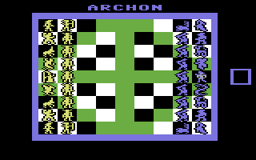
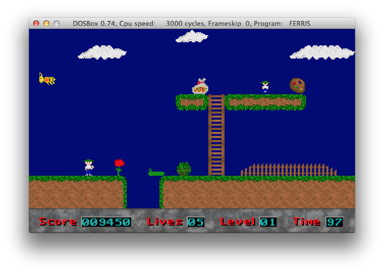

# The 1990s: Everything was better back then! How DosBox keeps memories alive.

I don’t know if this is only happening to me. But from time to time I find myself digging in my archived digital life. I have a folder on my hard drive called “Old Stuff” which resides under “Development”.

It usually starts with meeting an old friend from back in the 1990s, or by seeing an old 2D game with pixels the size of bricks. This makes me nostalgic.

Recently, I read a [blogpost by Scott Hanselman about how to run old games on modern computers in Dosbox](http://www.hanselman.com/blog/HowToRunOldButAwesomeGamesFromThe90sOnYourNewComputerWithDOSBox.aspx). And I started to think:

Wasn’t everything better back then? Well, not everything, but everything related to computers, programming and gaming at least? In my memories it was better – but it’s probably a good thing that we cannot bring back the past. Memories usually are better than reality really was. But then again…we had **Turbo Pascal** in the last century!


Turbo Pascal 6

And Turbo Pascal was a game changer for me. Before that I was doing BASIC. How boring. But Turbo Pascal  brought my excitement for programming a PC to a whole new level. I loved this language. And I loved especially one keyword: _assembler_ !

```armasm
procedure SetCrashXYWH(X, W, Y, H : Word; Num : Word); assembler;
	asm
	mov ax, Num
	shl ax, 4
	mov di, ax
	mov ax, CrashBuf
	mov es, ax
	mov ax, X
	stosw
	mov ax, W
	add ax, X
	stosw
	mov ax, Y
	stosw
	mov ax, H
	add ax, Y
	stosw
end;
```

Now that was cool. Not much Pascal left. But a lot of performance gained. It was possible to know every bit and register by name and access and manipulate it directly. And around these high performance methods – pardon, _procedures_ one could still write Pascal code for the parts of the application that weren’t required to squeeze out every cycle of the CPU.

For me, this was an ideal basis to write games. While others mostly used C, my clique used Turbo Pascal and x86 Assembler. It seemed the perfect combination for us and it probably lead to the fact that I never really got into C or C++. I used it. But I always thought, it’s ugly. And so I moved on to Java and today I’m using C# – but that’s a different story.

Back to the 1990s. More specifically to the year 1991.

## Diamonds Quest

In 1991 I wrote my first game. It is called Diamonds Quest. Never heard of it? Shame on you :-). But here’s your chance: [download it and play it in Dosbox](DiamondsQuest.zip) !


Boy, that’s ugly. But for me it was a milestone. My first full game. Man, was I proud!

Amazing 320×200 pixels resolution with 256 colors. It’s inspired by Boulder Dash. You have to collect all the diamonds, avoid the monsters, push rocks and later you even get bombs.

Of course it has a cheat mode. Start the game with “ **dquest.exe STACK-OVERFLOW** “. You will then get information how to apply cheats.

I did all the graphics pixel by pixel in good old Deluxe Paint IIe (Electronic Arts). Today it is a miracle to me how I got it too look “so good”. 🙂

## Crash & Dash


Overwhelmed by the \*sarcasm\* great success of Diamonds Quest, I had to continue the saga in 1992. The result was called Crash & Dash. This time, the close relation to Boulder Dash not only shows up in the name but also in the game play. But it added a set of special features which made game play more fun. And the best: it had digital sound via a Sound Blaster card. Yikes!


Crash’n Dash Gameplay

You have to make your way through 50 really hard levels to see the end screen. Again, Deluxe Paint IIe was my best friend for graphics and I made all of the graphics myself. Given I’m an absolute noob, I actually think it’s not that ugly. My age back then? I turned 16 in 1992.

If you want to try out the game, you will need Dosbox. [Crash’n Dash can be downloaded here](CrashDash.zip) .

If you’re an impatient player like I am today, feel free to use the cheat mode. Start the game, go the credits screen and press **SHIFT+S+O** – if you go back to the main menu, it will show “cheat mode” at the bottom right of the screen. During the game use ALT+W to finish a level, ALT+L to get 99 lives, ALT+T to reset the timer, ALT+I to get all extras.

## Archon Gold

Who doesn’t remember _Archon?_ Hands up! You missed one of the best games of the 1980s.



I was super excited by this game. So excited in fact that I wanted to port it over to the PC. In 1993, I called my version _Archon Gold_ . It had 256 colors and I painted all of the sprites pixel by pixel. Even today I still like what I achieved back then.


It had different scenarios for the fights. What’s so special about the fights, is the resolution. In order to have a bigger game field, I managed to use 360×350 pixels on a standard register compatible VGA card. This increased the available space by 97%. You can [download Archon Gold including all source here](ArchonGold.zip) .

Note that the game is not finished. It’s playable though. The reason for it being incomplete is that others had the same idea and thought it would be a good time to do a remake. The result was [Archon Ultra](http://www.myabandonware.com/game/archon-ultra-24a) , which got released in 1994. I loved the game and it looked amazing. So I put my one man show on hold.

Ferris the Wanderer
===================

End of 1993. The time was right to take the next step.

*   Hardware smooth scrolling
*   4 Channel digital sound (Amiga Modules)
*   “ModeX” 320×240 pixels
*   4300 lines of code the main program alone, most of it assembler.
*   An awesome sprite system (written by my friend Roland Ellermeyer) which took a bitmap as input and converted it into a assembler code (!) which you would pass and X and Y coordinate and it would “draw” itself at that location. The modern counterpart of this today is [PaintCode](http://www.paintcodeapp.com/)  – we were ahead of our time.

And I really invested a lot of time into the graphics. Again, I’m not a talent at all. But even today I love to look at Ferris. A game that is so clearly a clone of Mario and Giana Sisters that it’s hard to miss.

It adds additional components to the traditional gameplay: Ferris can turn himself invisible to avoid enemies. Some levels allow climbing into a helicopter. There are also a couple of boss enemies in the game. I really spent a lot of time on this game.




Ferris The Wanderer

If you want to give Ferris a try, [download it here](https://www.dropbox.com/s/eb36ia9o13318rg/Ferris.zip) . It comes with all the source and a level editor. Of course there’s a cheat mode: pause the game by pressing **P** . Then type **F E R R I S** (slowly!). Unpause. Now you can use **SHIFT+F1 to SHIFT+F8** to do various things.

## And then?

In 1994 times changed. Not only did I turn 18 and became interested in other things. I did not have the time anymore to sit and code for days and weeks. Also the hardware changed. Windows took over and it was hard to access the hardware. Games became bigger, better. I rather consumed them.

In 2008 the excitement came back: I bought an iPhone. Now (2021), I'm using Godot to develop a classic isometric game.