# März 2010: Ein Stelzenhaus für meinen Sohn

Ein Stelzenhaus soll es bitte sein, Papa. Wie kann der Papa da widerstehen? Also frisch ans Planen!

## Schritt 1: Planung

Ohne vorherige Planung geht natürlich nichts. Also erst einmal die Größe festlegen: 3m lang x 1.50m breit x 1.60m hoch (Plattform).

Und wie sieht das nachher im Garten aus? Hier hilft der Computer. Zuerst habe ich mir die Grundfläche aus vier Latten zusammengezimmert und abfotografiert. So kann ich nachher Fluchtpunkte finden und das Stelzenhaus in des Foto skizzieren. Der senkrechte Pfosten hillft mir das Lot zum Boden zu finden. Das sieht dann so aus:

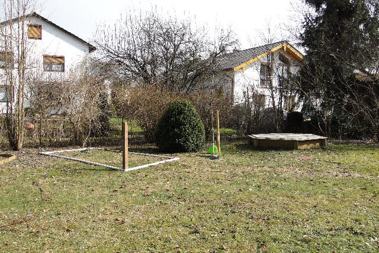

Das Bild habe ich mir dann ausgedruckt und transparentes Papier drübergelegt und das Häuschen konstruiert. Anschließend dann noch die Skizze einscannen, die Linien nachziehen und mit dem Original überlagern. Das Resultat:

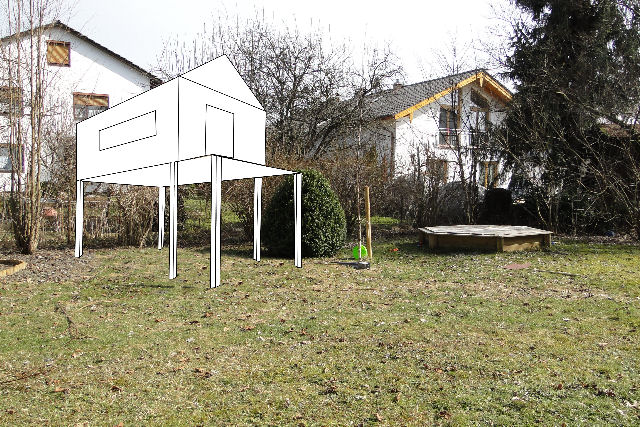

Wieder ausdrucken und nach Lust und Laune colorieren. So ähnlich soll es aussehen und man kann die Größe und Wirkung abschätzen.

Das Endresultat wird das mittler Stützenpaar auf halber Strecker der Längsseiten haben. Das Dach wird leicht überhängend und überstehend sein, da das gemütlicher aussieht.

Raphael freut sich schon auf sein Häuschen.

## Schritt 2: Die Rahmenteile

Innerhalb eines Tages sind drei Teile des Grundgerüstes entstanden: der vordere, mittlere und hintere Rahmen:

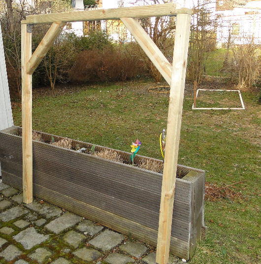

Die Stelzen sind 1.60m hoch und bestehen aus kesseldruckimprägniertem (KDI) Konstruktionsholz (7 x 7 cm).

Zur Stabilisierung verwende ich verstärkte Winkel sowie Diagonalelemente. Die Enden des oben aufliegenden Rahmenelementes sind abgesenkt, so dass später die Längsrahmenteile eingepasst werden können:

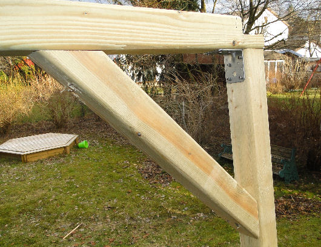

Ganz wichtig bei allen Aktionen: die Schrauben. Ich verwende ausschließlich Edelstahlschrauben (gibt es von SPAX z.B. bei Obi). Diese kosten zwar ein mittleres Vermögen (200 Stück 5×60 für 40.- Euro beispielsweise), haben aber den unschätzbaren Vorteil nicht abzureissen – und zwar weder beim Verarbeiten, noch später, falls das Holz geht und auch nicht, wenn Rost normale Schrauben längst spröde gemacht hätte.

Als Werkzeuge kommen zum Einsatz: ein starker Akkuschrauber, Winkel, Maßband und ein elektischer Fuchschwanz von Bosch. Die Stichsäge liefert nicht die erforderliche Schnittiefe und hat nicht genügend Power.

## Schritt 3: Grundgerüst aufstellen

Da die drei Rahmenteile nun fertig sind, kann es schon ans Aufstellen gehen. Es fehlen noch die Längsträger. Diese gibt es nicht im Baumarkt. Kanthölzer mit 3m Läng habe ich bei Perr in Riedering gefunden ( [http://www.perr-blockhaus.de/](http://www.perr-blockhaus.de/) ). Dort bekommt man auch bis zu 6m, aber wir wollen ja mal nicht übertreiben.

Die Längsträger werden aufgelegt und von oben angesenkt und anschließend von oben verschraubt, sowie mit Winkeln verstärkt. Zusätzlich kommen rings herum wieder Diagonalabstützungen. Ich habe mich dagegen entschieden die Träger bündig mit den Querträgern zu machen. Außer einer (subjektiv) besseren Optik brächte dies den Nachteil, dass die Längsträger nicht mehr die volle Dicke hätten und dadurch an Stabilität einbüßten.

Aussehen tut das Ganze dann so:

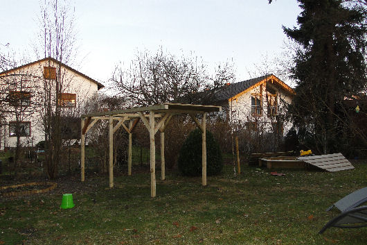

Es ist auch schon ein Teil der Terrassendielen angebracht, welche die Grundfläche bilden.

## Schritt 4: Fundament und restliche Dielen anbringen

Endlich mal wieder Zeit um weiter zu bauen! Diesmal waren die Fundamente dran und die restlichen Terrassendielen.  
Das Fundament wollte ich zuerst mit Estrich gießen, dann bin ich aber auf die Idee gekommen, dass es auch einfacher gehen könnte: Fertigbetonplatten! Bei Obi habe ich Platten mit den Maßen 40x40x5 cm bekommen. Bleischwer und massiv aus Beton.  
Diese lassen sich einfach anbohren und mit Dübeln kann man prima die Halter verschrauben:

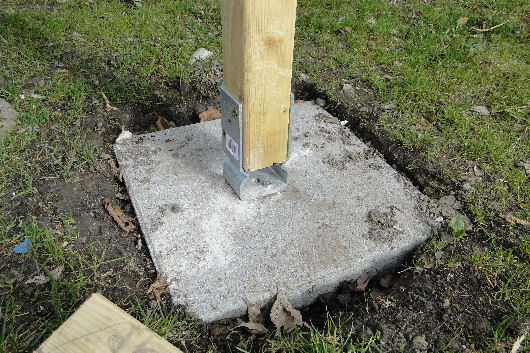

Diese Art von Halter sind im Nachhinein betrachtet ein Fehler gewesen. Sie sind nicht stabil genug, d.h. die ganze Plattform ist sehr leicht in Schwingung zu versetzen. Das bedeutet nicht, dass es instabil wäre, aber eben beweglich. Wenn es zu viel wackelt, tausche ich die Halter aus.  
Die Platten habe ich so weit im Erdreich versenkt, dass die Plattform gerade steht.

Anschließend noch die letzen Dielen drauf und die Plattform ist fertig:

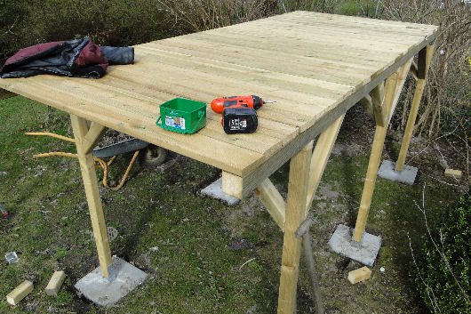

## Schritt 5: Die Seitenteile

Der Unterbau ist also fertig und wir können uns dem eigentlichen Häuschen widmen. Dieses besteht aus zwei vormontierten Teilen (vorne und hinten). Die Seiten werden einfach mit Nut-und-Feder Brettern verschlossen.  
Die Vordereite und Rückseiten werden in Rahmenbauweise mit Weißholz (38x58mm) erstellt und mit Winkeln verschraubt. Der Rahmen für die Vorderseite sieht so aus:

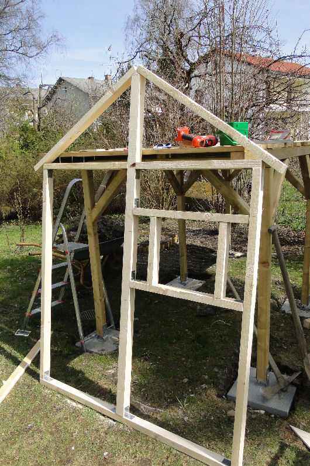

Fertig verschlossen sieht die Rückseite so aus:

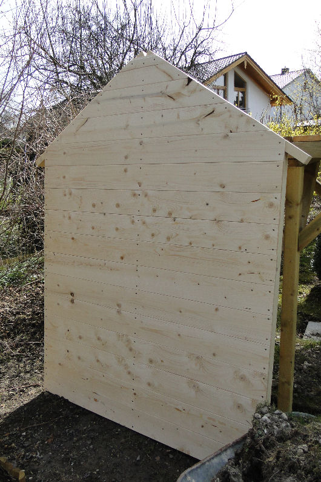

Diese Teile sind sehr schwer und es war ein Balanceakt, sie alleine (!) auf die Plattform zu hieven und dort zu fixieren, ohne dass sie umfallen. Ich habe die Teile aufgestellt und mit einem Balken nach vorne hin abgestützt. Anschließend habe ich einen Flachverbinder montiert und die Rückwand in die Senkrechte geklappt und fixiert. Diese Flachverbinder könne später wieder demontiert werden. Das untere Rahmenholz have ich mit dem Senkbohrer angebohrt und anschließend mit der Plattform verschraubt. Danach wackelt es schon nicht mehr so arg, aber erst die Verbindung von Vorderteil und Hinterteil bringt die richtige Stabilität. Zusammen sieht das dann so aus:

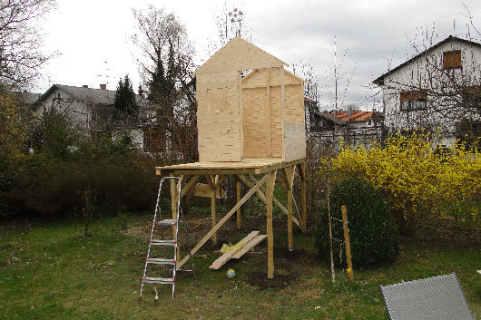

Nachdem wieder ein Teil geschafft ist, sieht man Papa und Sohn an, dass sie stolz sind:

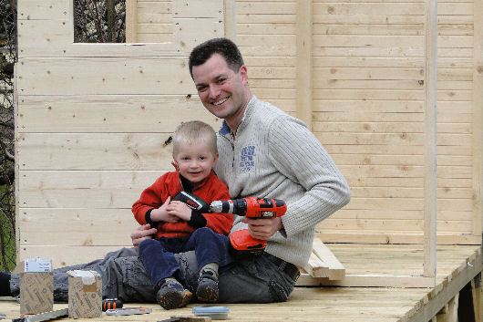

## Schritt 6: Dach und restliche Seiten verschließen

Die Seitenwände erfordern keinen eigenen Rahmen, sondern werden einfach mit Nut-Feder-Brettern (14mm, B-Ware) verschlossen.  
Rechts lasse ich ein Fenster von 100cm x 50cm Größe (Kommentar Raphi: “Guggu! Do Fensta!”). Um das Fenster rum habe ich einen Rahmen aus 36mm x 56mm Rahmenholz gebaut.

Das Dach besteht aus Leimholz (15mm), welches ich direkt auf die passende Größe zuschneiden habe lassen (225cm x 102cm). Die Dinger sind unglaublich schwer.

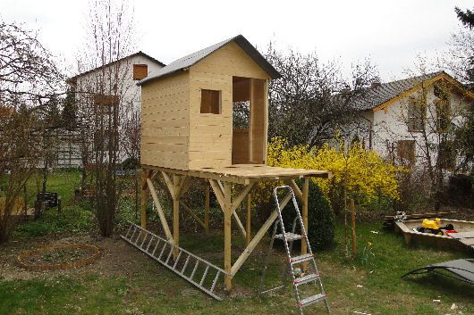

Das Dach ist mit einer billigen Bitumenmatte gegen Regen geschützt. Wichtig ist: an den Rändern anfangen und die nächste höhere Bahn überlappen lassen, so dass das Wasser nicht unter die überlappenden Matten laufen kann.

Die Matten werden mit dem Tacker befestigt.

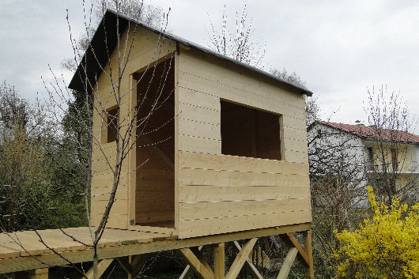

Auf der rechten Seite: das große Panoramafenster.

Nächste Woche geht’s weiter mit der Türe und dem Balkon.

## Schritt 7: Balkon, Türe und Rutsche

Und wieder ist eine Woche rum. Dieser Samstag war reserviert für die Türe, den Balkon und dem Anbau einer Rutsche.

Der Reihe nach. Die Rutsche gibt es in zwei Längen bei Obi. Auf Grund der Höhe ist hier die 3m lange Version verbaut. Rutscht perfekt, ich habe es selber ausprobiert! 🙂

Das Balkongeländer besteht aus KDI Zaunlatten, das Stück zu 2.59€. Die Riegel sind ebenfalls KDI Kantholze 5x5cm. Alles ordentlich verschraubt und fertig.

Für die Türe habe ich mir einen Rahmen gebaut aus billige sägerauhen Latten (die, aus denen im ersten Schritt der Grundrissrahmen enstanden ist). Dann eine Querstrebe rein und von ausßen mit Nut-und-Feder Brettern verkleidet. Drei Scharniere dran und fertig ist die Türe.

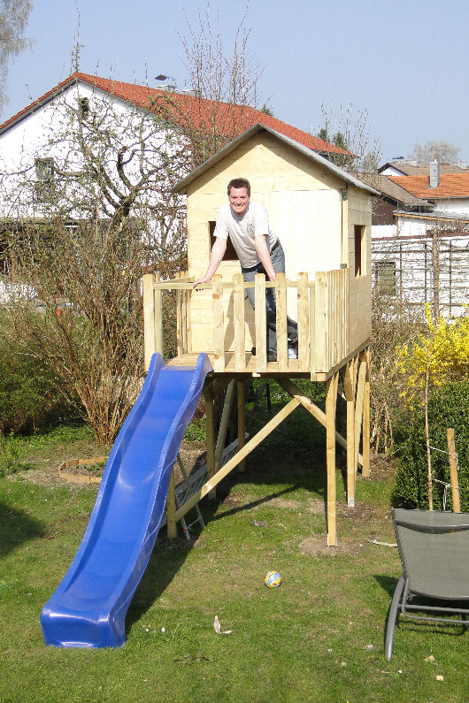

Anschließend habe ich das bis jetzt noch unbehandelte Holz ein erstes Mal gestrichen. Ein zweiter Anstrich ist notwendig und zwar auch innen, so dass die Feuchtigkeit dem Holz nichts mehr anhaben kann.

Jetzt fehlen noch eine Leiter oder Treppe, sowie die Fenster und ein bisschen Einrichtung – es soll ja gemütlich werden.