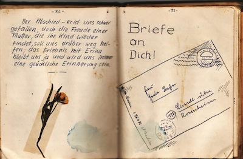

Letztens fand ich ein Tagebuch meines Großvaters [Manfred Bacher](https://de.wikipedia.org/wiki/Manfred_Bacher) , welches er während des zweiten Weltkrieges schrieb. Die Beschreibungen darin gehen mir sehr zu Herzen, aber eine Geschichte ist so speziell, dass ich sie hier niederschreiben möchte. Meine stille Hoffnung: vielleicht lebt die betroffene Dame namens Erika Schwarz noch und vielleicht googelt eines ihrer Kinder, Enkel oder Urenkel nach ihrem Namen und findet diese Geschichte hier. Vielleicht möchte sich Erika dann mit mir in Verbindung setzen, denn ich würde nur zu gerne wissen, was aus ihr geworden ist.

**“Erika”**

Trecks – Trecks, und immer nur Trecks; und Kälte – sogar der Wind scheint eingefroren zu sein und hat sein Stürmen eingestellt.

Ostpreussen – ein fahrendes Volk. Immer noch nimmt der Zug der Not und des Elends kein Ende. Tag und Nacht wälzt sich der graue Wurm vorwärts. Und doch scheint das Ganze eine tote Masse zu sein, denn das Bild bleibt immer dasselbe: müde ausgemergelte Pferde mit hausratvollgestopften Wagen dahinter, in Pelzen und Mäntel gehüllte Menschen, deren Augen wie erloschen im Gesicht liegen.

An manchen Wagen sind Schilder befestigt: Kreis Tilsit, Kreis Allenstein, Insterburg, Osterrode, Warmditten, Labiau.

Ostpreussen ist im Aufbruch, auf der Flucht vor dem Schrecken des Ostens. Immer mehr wagen füllen die Straßen. Zu zweien, zu dreien nebeneinander rollen sie nach Westen, durch Samland über die Nehrung nach Pommern oder nach Braunster und über das Eis nach Danzig.

Nun steht die endlose Kolonne wieder, für Stunden vielleicht oder für Tage, denn auf einer Seitenstraße  schiebt sich ein neuer unabsehbarer Treck dazwischen…

Es geht weiter – Da vorne stürzt ein Wagen um! Das hintere Rad ist gebrochen. Auf dem Schild es gestürzten Fahrzeugs steht zu lesen: “E. Schwarz Buchwalde Kreis Osterode/PR.”

Ein kleines Mädchen von vielleicht zehn Jahren steigt aus, hinterher kommt ihre Mutter, ein in Decken gewickeltes, nur wenige Monate altes Kind auf dem Arm.

Von den nachfolgenden Wagen wird der Wagen zur Seite geschoben – der graue Wurm wälzt sich weiter.

Plötzlich dröhnt die Luft! Erschreckt bäumen sich die müde dahin stampfenden Pferde auf – Tiefflieger! Und schon prasseln die Garben russischer Schlachtflieger in die lebendige Kette, hier und da gehen Erdfontainen und Wagenteile hoch – krepierende Bomben. Ein heilloses Durcheinander in den Fahrzeugreihen, dazwischen die markerschütternden Schreie tödlich getroffener Menschen und verendender Tiere.

Erst allmählich kommt wieder Ordnung in die Wagenkette, die ihren Weg wieder fortfährt, immer weiter über die Straßen Ostpreußens. Am Straßenrand liegen jetzt tote Pferde, zersplitterte Wagen.

_Ich sah sie, die Heimatlosen_  
_wandern durch Brand und Not –_  
_rastlos und endlos –_  
_verfolgt durch den Tod._  
_Ohne Tränen war ihr Auge_  
_Und ohne Leben ihr Gesicht –_  
_Oh Grauen und Elend_  
_du endest nicht!_

Den ganzen Tag haben wir gearbeitet, ohne Essen, (es war ja auch alles ausgegangen) bei der nun schon seit 8 Tagen anhaltenden Kälte, um bis zum nächsten morgen die Maschinen klar zur Verlegung zu bekommen. Als wir uns erschöpft ins Bett legen wollen, kündigt das Krachen der Granaten den Durchbruch russischer Panzer auf den Horst an. Erst gegen vier Uhr morgens tritt etwas Beruhigung ein. Heinz, mein Freund und Funker geht gleich zum Flugzeug während ich auf dem Gefechtsstand den Flugbefehl übernehme.

Durch den klirrenden Frost stapft Heinz ins Freie. Da – weint da nicht ein Kind? Er sieht sich um, läßt seine Taschenlampe aufblitzen: Ein kleines Mädchen sitzt auf einem Stein, zusammengerollt kauert, vor Kälte zitternd und weint. In der einen Hand trägt sie ein kleines Köfferchen, in der anderen ein Stück Brot.

“Warum weinst du?” fragt Heinz.

“Man hat mich hier allein gelassen und ich kann nicht gehen, weil ich die Füße erfroren hab’ und meine Mutti hab’ ich verloren.”

Heinz nimmt sie auf den Arm.

“Wie heißt du denn?”

“Erika Schwarz.”

“Und woher kommst du?”

“Aus Buchwalde, Kreis Osterode.”

Das Mädchen hat zu weinen aufgehört.

“Onkel, ich muß einmal”, sagt sie ganz leis und treuherzig.

Der Onkel Heinz trägt sie also zu dem dafür bestimmten Ort. Dann bringt er sie wieder auf den Stein zurück.

“Warte mal, Erika, ich komme gleich wieder.”

Heinz erzählt mir von seiner Begegnung und unser Entschluß ist gleich gefaßt: Klein-Erika wird mitgenommen!

Sobald ein leichtes Dämmern den kommenden Tag vermuten läßt, wird gestartet. Mit Personen und Gepäck hundertprozentig überladen, finden wir kaum einen Platz für Erika. Heinz nimmt sie auf den Schoß, wickelt sie in eine Decke ein und los kann’s gehen. Die Startbahn reicht auf Grund der großen Beladung nur noch knapp, aber wie kommen raus.

Der Wettergott meint es ja nicht gerade gut mit uns, dafür hilft uns die holde Fortuna mit einem Sack voll Glück aus, sodaß wir trotz Schneeschauer und Sturmwind unser Ziel gut erreichen. Daß und zwischendurch die eigne leichte Flak etwas beharkt, kann uns nicht erschüttern. Klein-Erika hat sich tapfer gehalten, allerdings: die Mütze des Bordschützen muß mal als Eimer fungieren, sonst geht alles gut.

Nach der Landung gehen wir zur Flugleitung und holen und die Bordverpflegung ab. Erika bekommt natürlich auch ihre Schokolade, Keks, Drops u.s.w., wie es ihr als Passagier der Luftwaffe zusteht. Während wir für uns und für die Staffel Quartier machen, wird Erika in einem freien Raum auf einem Strohsack untergebracht, damit sie schlafen kann.

Nach einer Stunden kehren Heinz und ich zurück und finden folgendes Bild vor: Klein-Erika ist umringt von einer Mädchen- und Frauenschar, sie ist frisch gewaschen und gekämmt, vor ihr bauen sich Kuchen, Plätzchen und Wurstbrote zu Pyramiden auf. Unser Verwandtenkreis ist um ein Wesentliches vergrößert worden, denn wir werden nur noch als Onkel Heinz und Onkel Fredl angesprochen. Und wie wir uns in unseren neuen Onkel- und Paparollen fühlen!

Abend ziehen wir in unsere neue Wohnung ein, d.h.: wir packen alles aus und schaffen in kurzer Zeit einen Junggesellenbudenzauber, in dem ein Gegenstand den anderen nicht mehr sieht. Dann gehen wir essen, Erika muß einstweilen allein bleiben.

Und wieder sollte uns bei unserer Rückkehr eine Überraschung beschert sein. Unsere Bude ist blitzsauber aufgeräumt, die Betten sind gerichtet, der Tisch gedeckt. Unsere neuen Tanten haben ganze Arbeit geleistet.

Am anderen Tag bringen wir unsere Tochter zum Arzt. Ein bißchen Angst hat Erika zwar und ein paar Tränen kostet’s auch, aber der gute Doktor und seine braven Krankenschwestern betreuen sie ganz zart und behutsam. Die Füßchen sind dick angeschwollen und zum Teil schon gefühllos geworden. Der Arzt mein, vier bis sechs Wochen würde es noch dauern, bis Erika wieder laufen kann.

Wie haben wir uns gefreut, nach den schweren Tagen in Ostpreussen endlich wieder in ruhigem Gebiet zu sein! Doch es sollte anders kommen – Zwei Tage waren wir gerade wieder häuslich verankert, da kommt uns die in letzter Zeit zu so häufig gehörte Meldung zu Ohren: “Der Russe ist durchgebrochen!” Bis 17.00 Uhr müssen wir gestartet sein, sonst wird unser Flugzeug gesprengt. Doch wie sollen wir bei dem Wetter starten können? Dickster Nebel liegt überall, Vereisungsgefahr droht in den Wolken. Es ist unmöglich! Wir hoffen ja, daß das Wetter sich bis zur gesetzten Frist noch verbessert, aber nur wenige Meter erhöht sich die Sicht. gegen 16.00 Uhr halten wir Kriegsrat. Fliegen wir, so besteht nur eine geringe Chance, lebend davonzukommen, bleiben wir hier, was geschieht dann mit Erika?

Wir fliegen…

Vor uns starten ein paar Maschinen, aber weit kommen sie nicht, dann liegen sie schon unten. Während ich zum Start rolle – es ist 1700 – gehen am Platzrand Flugzeuge brennend in die Luft. Sie werden gesprengt. Wir können dadurch wenigstens den Platz erkennen.

Das Glück flog mit uns, wir Landen glatt auf dem neuen Horst.

Nach einem nicht allzu bescheidenen Schluck auf unser Glück bringen wir Erika erst einmal zum Arzt. Sie wird sogar im Auto gefahren.

Nachdem wir uns wieder wohnlich eingerichtet haben, stellen wir einen Erziehungs – und Betreuungsplan auf. Alle vier Tage Solen Onkel Heinz und Onkel Fredl abwechslungsweise den Papa vom Dienst spielen. Wegen Bettenmangel schläft Klein-Erika immer bei dem jeweils diensthabenden Papa.

Erika hatte gerade vier Nächte bei Heinz geschlafen und eine Nacht bei mir, da meint sie:

“Onkel Heinz!”

“Hm?”

“Du, der Onkel Fred ist genau so ein Schmuser wie Du!”

Erika ist natürlich in Truppenverpflegung und steht in der Verpflegungsliste als “Flieger Schwarz”. Aber mit dem Einhalten der Mahlzeiten klappt es nicht so recht, denn bis zum Mittagessen haben die Kameraden der Staffel schon soviel Leckereien gebracht, daß das eigentliche Essen nicht mehr recht schmecken will und mit dem Abendbrot geht’s genauso.

Eine Woche ist Erika bereits bei uns. Sie ist schon so sehr an uns gewöhnt und duldet nicht, dass wir sie allein lassen. Als Heinz und ich gestern auf Feindflug gingen, wollte sie unbedingt mir. Unsere Versicherung, daß wir in ein paar Stunden wiederkommen würden, half nichts. Erst als Heinz auf den guten Gedanken kam, seinen Rock auf den Stuhl zu hängen, glaubte sie daran, daß wir sie nicht allein lassen würden und ihr Tränenstrom versiegte.

Heute schrieben wir gemeinsam einen Brief an die Berliner Tante von Erika. Die Adresse wusste sie noch ganz genau. Es wurde ein langer Brief, in dem Erika all ihre Erlebnisse bis zu unserem Zusammentreffen schilderte. Er lautete etwa:

_Liebe Tante Martha!_

_Ich habe meine Mutti verloren. Erst fuhr ich mit Mutti und Papa auf dem Wagen. Dann ist Papa wieder umgekehrt und ging zum Volksturm. Dann brach unser Wagen und ich wurde auf den Wagen der Tante gehoben. Abends sagte die Tante zu mir: Ich habe keinen Platz mehr, suche deine Mutti wieder. Da bin ich all die Wagen abgelaufen, aber ich habe meine Mutti nicht gefunden und ich habe mir die Füße erfroren. Ich bin mit der Eisenbahn gefahren und eine Frau hat mich dann auf den Flugplatz gebracht zum Doktor. Als die Russen kamen mußte ich auch dem Krankenhaus heraus und ein Soldat hat mich zur Kommandantur gebracht. Dort fand mich denn der Onkel Heinz._

_Recht viele Grüße,_

_Deine Erika._

Eines Tages kam eine der vielen auch hier vorhandenen “Tanten” und brachte drei Märchenbücher. War das eine Freude! Es gehörte nun selbstverständlich zum täglichen Programm, daß Onkel Heinz oder ich ein Märchen vorlas. Obwohl wir uns doch schon als alte Ehegatten fühlten – wir lauschten genau so gespannt wie Erika, ganz gleich ob es sich um Schneewittchen mit den  sieben Zwergen oder den verzauberten Prinzen handelte.

Ich habe auch nie gedacht, daß man mit einem Kinde soviel Freude haben kann. Wann man gerade mit Papadienst dran war, mußte man ja auch die ganze Betreuung und Aufsicht übernehmen. Morgens Waschen und anziehen, dann das große Problem: Zöpfe flechten. Heinz machte das zum ersten Mal. Der rechte Zopf wurde so fest, daß er wie ein Horn wegstand. Als ich dann, ihn belehrend, den linken in Arbeit nahm und eine Stunde vergangen war, stellte sich heraus, daß er sich in Wohlgefallen b.z.w in Einzelheiten aufgelöst hatte. Aller Anfang ist schwer!

Nach dem Frühstück, das Klein-Erika sich bald selbst zubereitete, sangen die beiden Onkels meist einen Morgengruß, begleitet mit der Klampfe. Die Texte dazu konnte unser Töchterchen ja bald, aber mit dem Singen wollte es nicht klappen, denn sie war vollkommen unmusikalisch

Und nun kam der Patient an die Reihe. Erika wurde im Huckepack auf die Schultern gesetzt und dann ging’s zum Doktor, oder, wenn dieser mal nicht anwesend war, zur Schwester Elisabeth, die mit Salbe und einem Stück Kuchen unsere Erika immer mehr kurierten.

Den Mittag und Nachmittag über mußte Erika immer allein bleiben, das heißt, sie beiden Onkels waren eben nicht da, Besuch aber kam genügend, sodaß der Kleinen nie langweilig wurde; vor allen Dingen: wir brauchten nie aufräumen, denn irgend eine von den vielen Tanten kam schon, die dann sauber machte.

Und doch, hin und wieder wenn wir nach Hause kamen, da weinte Klein-Erika. Fragte man dann, warum die Tränlein flossen, dann war nichts aus ihr heraus zu bringen. Sie hatte halt Heimweh nach ihrer Mutti – das arme heimatlose Kind.

Gegen acht Uhr abends wurde Erika ins Bett gesteckt. Mit dem Papa gemeinsam betete sie noch das “Vaterunser”. Ich habe noch kein Gebet so tief empfunden, wie das der kleinen Erika. Wo wurden diese Minuten des Abends immer zu einem tiefen Erlebnis für uns.

Als Kind vom Lande stand Erika natürlich genau so früh auf, wie sie ins Bett gegangen war. Daß der Onkel mit ihr aufwachen mußte, war selbstverständlich, dafür sorgten schon Erikas Zöge, die ihm wie ein Pinsel im Gesicht rumwischten. Auf diese Art und Weise mußten selbst wir alten Langschläfer noch zum Frühaufsteher erzogen werden.

Jetzt sind wir mittlerweile schon sechs Wochen Papa und seit gestern kann Erika sogar schon gehen. In den großen Filzstiefeln, aber, und das stärkt unsere Trägheit wieder, wir brauchen sie wenigstens nicht mehr zum Klo zu tragen, ein Geschäft, das doch ein paar Mal am Tag erforderlich war.

Erika wird also heute ausgehen. Die ersten Gehversuche haben geklappt, denn los! Wir treffen die Auswahl aus der reichen Garderobe, zu der alle Bekannten beigesteuert haben. Soviel Kleider, Blusen und Röcke hat Klein-Erika wahrscheinlich noch nie besessen, wie jetzt. Als Erstes besucht Erika die gute Schwester Elisabeth und den Onkel Doktor. Sie haben sich ja um ihre Gesundheit am meisten verdient gemacht. Dann wird photographiert. Wie stolz wir uns mit unserer Tochter aufstellen, kann man sich denken.

Vor kurzem kam dann ein Anruf: ich meldete mich und höre: “Hier ist Hauptmann D… von den Nachtjägern. Sie haben doch aus Ostpreussen ein Mädchen mitgebracht. Ich bin auch aus Ostpreussen und außerdem habe ich hier genug Platz. Geben Sie mir das Kind! Was wollen Sie dafür haben?”

Nein, Erika ist für nichts zu haben, wir behalten sie schon selbst.

Aber lange sollte uns Erika nicht mehr bleiben. Eines Tages, wir kamen vom Feindflug zurück, da fanden wir auf dem Tisch einen Brief liegen: Erika’s Onkel aus Berlin war gekommen, um Erika abzuholen. Er war inzwischen mit Erika spazieren gegangen. Nachmittags, gegen 16.00 Uhr kamen die beiden zurück. Wir mußten Abschied feiern, denn am anderen Morgen fuhr Erika davon. Der Onkel erzählte uns, daß Erika’s Mutter geschrieben hatte. Sie war mit ihrem sieben Monate alten Töchterlein Ingrid auf einem Kriegsschiff, unter Zurücklassung all ihres Eigentums von Ostpreussen nach Hamburg gekommen und klagte nun ihr Leid über ihre verlorene Erika.

Der Abschied – er ist uns schwer gefallen, doch die Freude einer Mutter, die ihr Kind wieder findet, soll uns drüber weg helfen; der Erlebnis mit Erika bleibt uns ja und wird uns immer eine glückliche Erinnerung sein.