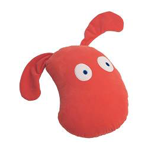

# Hi!

I'm happy you're here, although I don't exactly know what it is that you're looking for. :-)

* [**Blog posts**](content/blog/index.md)
* **Information about me** - just scroll down

## Me, myself and I

I’m a software developer from Germany. I started programming in Turbo Pascal and x86 assembler back in the 1990s.

Later, I studied and achieved my MSc in Computer Science. This involved lots of C, C++, Java, and even [ADA](https://en.wikipedia.org/wiki/Ada_(programming_language)) - and none of these languages made me particularly happy. But then I discovered Microsoft's C# and it was a game changer. Over the years, I have learned that C# is the language I love most and I was able to use it extensively in my career.

These days I work for Microsoft in the "Learn" team, building solutions to help every person on the planet to achieve more and have the opportunity to learn. Go, !(https://docs.microsoft.com/learn)[check it out]!

### Let's stay in touch

* The easiest way to contact me is by email. It's a gmail.com account named  `rene.ruppert`
* [LinkedIn](https://de.linkedin.com/in/krumelur?trk=profile-badge)
* I'm active on StackOverflow.com
    
    
* Github [https://github.com/krumelur](https://github.com/krumelur)

### What is a Krumelur?

I don't exactly know. But here’s the story behind it being my avatar and alias: when I was grumpy once my wive told me to stop grumbling - in German, that's “grummeln”. Hence, she called me a “Grummelur”. Later while shopping at IKEA we found a cushion/animal called “Krumelur” and she said “look, that’s you!”. That’s when I started using it as an alias.

_Fun fact: one of my former coworkers from Finland once explained that “krumeluuri” would be useless stuff one has at home…_

IKEA’s Krumelur

René Ruppert  
[info@c-sharx.net](mailto:info@c-sharx.net)